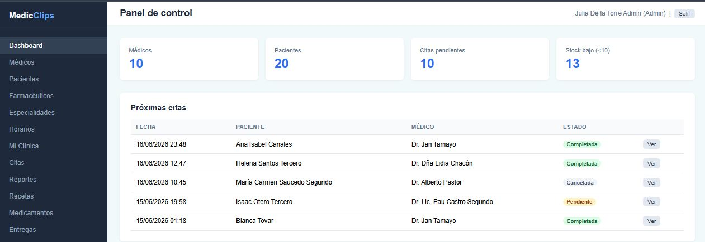

<p align="center">
  
</p>

<h1 align="center">🏥 MedicClips</h1>

<p align="center">
  <strong>Plataforma SaaS Multi-Tenant para gestión inteligente de clínicas médicas</strong>
</p>

<p align="center">
  
  
  
  
  
</p>

<p align="center">
  <a href="#-demo">🎯 Demo</a> •
  <a href="#-características">✨ Características</a> •
  <a href="#-instalación">🚀 Instalación</a> •
  <a href="#-credenciales">🔐 Credenciales</a> •
  <a href="#-estructura">📁 Estructura</a> •
  <a href="#-tecnologías">🛠 Tecnologías</a>
</p>

---

## 📸 Vista del Sistema

<p align="center">
  
</p>

---

## 🎯 Demo

> **URL de acceso (local):** `http://127.0.0.1:8000`

| Rol | Email | Contraseña |
|---|---|---|
| 🛡️ Administrador | `admin@demo.com` | `password` |
| 🩺 Médico | `medico@demo.com` | `password` |
| 🧑 Paciente | `paciente@demo.com` | `password` |
| 💊 Farmacéutico | `farmaceutico@demo.com` | `password` |

---

## ✨ Características

MedicClips es una plataforma **multi-tenant** que permite a múltiples clínicas operar de forma aislada y segura desde una misma instalación.

### 🏥 Gestión de Clínicas
- Registro y administración de múltiples clínicas (tenants)
- Control de plan de suscripción (Básico, Pro, Empresarial)
- Gestión de vigencia y estado de la clínica

### 🩺 Gestión de Médicos
- Alta de médicos con especialidad, licencia y biografía
- Configuración de horarios de atención por día
- Asociación de médicos a su clínica correspondiente

### 🧑‍🤝‍🧑 Gestión de Pacientes
- Expediente clínico completo (género, grupo sanguíneo, contacto de emergencia)
- Historial de citas y reportes clínicos
- Registro de recetas y medicamentos recibidos

### 📅 Citas Médicas
- Agendamiento de citas con médico y paciente
- Estados: `pendiente`, `completada`, `cancelada`
- Control de motivo de consulta

### 📋 Reportes Clínicos y Recetas
- Creación de reportes clínicos ligados a citas completadas
- Generación de recetas con instrucciones generales
- Gestión de medicamentos por receta

### 💊 Farmacia e Inventario
- Control de stock de medicamentos por clínica
- Alertas de bajo stock (< 10 unidades)
- Registro de entregas por farmacéutico

### 💳 Pagos y Suscripciones
- Registro de transacciones de pago por clínica
- Control de estado de pago y fecha de pago

### 🔔 Notificaciones
- Sistema de invitaciones a médicos, pacientes y farmacéuticos
- Notificaciones automáticas de estado de citas

---

## 🚀 Instalación

### Requisitos Previos

| Herramienta | Versión mínima |
|---|---|
| PHP | 8.2+ |
| Composer | 2.x |
| PostgreSQL | 14+ |
| Node.js | 18+ |
| Git | Cualquiera |

### Paso 1 — Clonar el repositorio

```bash
git clone https://github.com/JHEINERLP/Mediclips-.git
cd Mediclips-
```

### Paso 2 — Instalar dependencias

```bash
# Dependencias PHP
composer install

# Dependencias Node.js
npm install
```

### Paso 3 — Configurar el entorno

```bash
# Copiar el archivo de entorno
cp .env.example .env   # Linux/Mac
copy .env.example .env # Windows

# Generar la clave de la aplicación
php artisan key:generate
```

Edita el archivo `.env` con tus credenciales de PostgreSQL:

```env
DB_CONNECTION=pgsql
DB_HOST=127.0.0.1
DB_PORT=5432
DB_DATABASE=Mediclips
DB_USERNAME=postgres
DB_PASSWORD=tu_contraseña
```

### Paso 4 — Crear la base de datos

Abre **pgAdmin** o la terminal de PostgreSQL y ejecuta:

```sql
CREATE DATABASE "Mediclips";
```

### Paso 5 — Ejecutar migraciones y datos demo

```bash
# Crear tablas y cargar datos de demostración
php artisan migrate --seed
```

Esto carga automáticamente:
- 🏥 **5 Clínicas** con datos completos
- 👥 **160 Usuarios** (admins, médicos, pacientes, farmacéuticos)
- 🩺 **50 Médicos** con especialidades y horarios
- 🧑 **100 Pacientes** con fichas clínicas
- 📅 **200 Citas** médicas
- 💊 **150 Medicamentos** en inventario
- 📋 **69 Reportes** clínicos y recetas
- 📦 **88 Entregas** de medicamentos

### Paso 6 — Compilar assets y lanzar el servidor

```bash
# Compilar CSS/JS para producción
npm run build

# Iniciar el servidor de desarrollo
php artisan serve
```

Abre tu navegador en: **http://127.0.0.1:8000** 🎉

---

## 🔐 Credenciales de Demo

Todos los usuarios pertenecen a **Clínica Médica Demo**.

| Rol | Email | Contraseña | Permisos |
|---|---|---|---|
| 🛡️ **Admin** | `admin@demo.com` | `password` | Acceso total al sistema |
| 🩺 **Médico** | `medico@demo.com` | `password` | Citas, reportes, recetas |
| 🧑 **Paciente** | `paciente@demo.com` | `password` | Mis citas |
| 💊 **Farmacéutico** | `farmaceutico@demo.com` | `password` | Medicamentos y entregas |

---

## 🌐 Páginas Disponibles

| Página | URL |
|---|---|
| 🏠 Landing Page | `http://127.0.0.1:8000` |
| 🔐 Iniciar Sesión | `http://127.0.0.1:8000/login` |
| 🏢 Registro de Empresa | `http://127.0.0.1:8000/registro-empresa` |
| 🧑 Registro de Paciente | `http://127.0.0.1:8000/registro-paciente` |
| 📊 Dashboard | `http://127.0.0.1:8000/dashboard` *(requiere login)* |
| 📅 Citas | `http://127.0.0.1:8000/citas` |
| 👨‍⚕️ Médicos | `http://127.0.0.1:8000/medicos` |
| 🧑 Pacientes | `http://127.0.0.1:8000/pacientes` |
| 💊 Medicamentos | `http://127.0.0.1:8000/medicamentos` |

---

## 📁 Estructura del Proyecto

```
Mediclips/
├── app/
│   ├── Http/
│   │   ├── Controllers/
│   │   │   ├── Auth/              # Login, registro empresa/paciente
│   │   │   ├── DashboardController.php
│   │   │   ├── CitaController.php
│   │   │   ├── MedicoController.php
│   │   │   ├── PacienteController.php
│   │   │   ├── MedicamentoController.php
│   │   │   ├── RecetaController.php
│   │   │   ├── ReporteClinicoController.php
│   │   │   ├── EntregaMedicamentoController.php
│   │   │   └── FarmaceuticoController.php
│   │   └── Middleware/
│   │       ├── EnsureClinica.php  # Valida tenant activo
│   │       └── RoleMiddleware.php # Control de roles
│   └── Models/
│       ├── Clinica.php
│       ├── User.php
│       ├── Medico.php
│       ├── Paciente.php
│       ├── Cita.php
│       ├── Medicamento.php
│       ├── Receta.php
│       ├── ReporteClinico.php
│       ├── EntregaMedicamento.php
│       └── TransaccionPago.php
├── database/
│   ├── migrations/                # Estructura de la BD
│   └── seeders/
│       └── DatabaseSeeder.php     # Datos de demostración
├── public/
│   ├── assets/                    # Imágenes y recursos
│   └── css/                       # Hojas de estilo
├── resources/
│   └── views/
│       ├── welcome.blade.php      # Landing page
│       ├── dashboard/             # Panel de control
│       ├── citas/                 # Gestión de citas
│       ├── medicos/               # Gestión de médicos
│       ├── pacientes/             # Gestión de pacientes
│       ├── medicamentos/          # Inventario
│       └── auth/                  # Login y registro
└── routes/
    └── web.php                    # Rutas de la aplicación
```

---

## 🛠 Tecnologías

| Capa | Tecnología |
|---|---|
| **Backend** | Laravel 12 (PHP 8.2) |
| **Base de Datos** | PostgreSQL 14+ |
| **Frontend** | Blade Templates + CSS3 Vanilla |
| **Build Tool** | Vite 5 |
| **Autenticación** | Laravel Auth (sesiones) |
| **Multi-tenancy** | Middleware personalizado por `clinica_id` |
| **Faker / Seeding** | FakerPHP (locale `es_ES`) |
| **Servidor local** | `php artisan serve` |

---

## 🛠️ Comandos de Desarrollo

```bash
# Iniciar servidor
php artisan serve

# Rehacer toda la BD con datos frescos
php artisan migrate:fresh --seed

# Solo recargar datos de prueba
php artisan db:seed

# Ver todas las rutas registradas
php artisan route:list

# Limpiar cachés
php artisan optimize:clear

# Consola interactiva
php artisan tinker
```

---

## 🗃️ Esquema de Base de Datos

```
clinicas ──┬── users ──┬── medicos ──── horarios
           │           ├── pacientes
           │           └── (farmaceutico, admin)
           ├── medicamentos
           ├── especialidades
           └── citas ──── reportes_clinicos ──── recetas ──── entregas_medicamentos
```

---

## 🤝 Contribuir

1. Haz un **fork** del repositorio
2. Crea una rama para tu feature: `git checkout -b feature/nueva-funcionalidad`
3. Haz commit de tus cambios: `git commit -m 'feat: agrega nueva funcionalidad'`
4. Haz push a tu rama: `git push origin feature/nueva-funcionalidad`
5. Abre un **Pull Request**

---

## 📄 Licencia

Este proyecto está bajo la licencia **MIT**. Consulta el archivo [LICENSE](LICENSE) para más información.

---

<p align="center">
  Otro Proyecto de Goldsam — <strong>MedicClips SaaS</strong> © 2026<br>
  Hecho con ❤️ por el equipo de desarrollo
</p>
